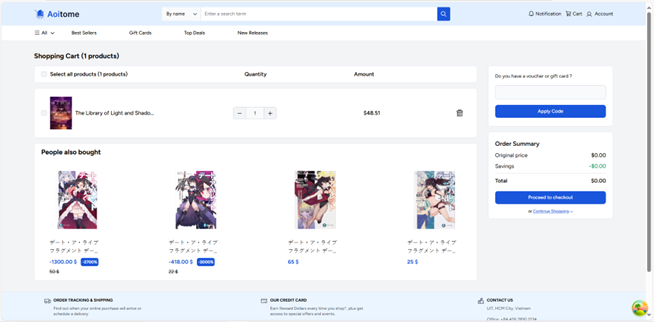
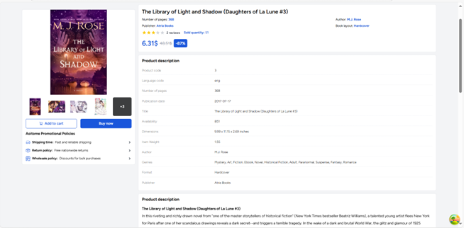
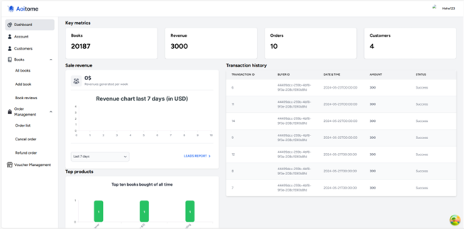

# Aoitome Bookstore Frontend 

## Preview

### To view the repo containing the backend of this project, please follow this [link](https://github.com/4nh3k/BookStore).

A Bookstore E-Commerce website based on ReactJS and Tailwind CSS.

## Features
- Login, Logout, Forgot Password for Authentication & Authorization
- Homepage, Cart, Product Detail, Order, Account page for Customer
- Dashboard, Product Management, Customer Management, Order Management for Admin

## Installation
1. Clone the repository
 `[git clone https://github.com/4nh3k/BookStore.git](https://github.com/4nh3k/BookStoreFE)`
2. Open the terminal in project root and install dependencies using: npm install
3. Run the project using the command: npm run dev
4. Open the website using the url: https://localhost:3000
5. Login by creating a new account for user (for admin functionalities please login through admin - admin (username - password))
